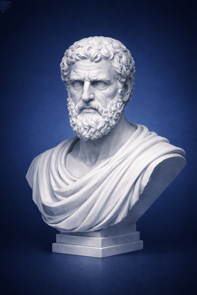

# Demo Repo (Small)

## Table of Contents
- [Acknowledgments](#acknowledgments)
- [JSONL REPL protocol (summary)](#jsonl-repl-protocol-summary)
- [Budgets and guardrails (default behavior)](#budgets-and-guardrails-default-behavior)
- [Output blocks (required for persistence)](#output-blocks-required-for-persistence)

This tiny repo exists for golden tests and example runs.

- `src/main.py` is the entrypoint.
- `src/app.py` defines a minimal service.
- `config.yaml` holds a sample config key.

## Acknowledgments
This skill is inspired by and references:
- Zhang et al., "Recursive Language Models" (arXiv:2512.24601v1): https://arxiv.org/abs/2512.24601v1
- Alex Zhang's reference implementation: https://github.com/alexzhang13/rlm
- Original announcement thread: https://x.com/a1zhang/status/2007566581409144852?s=46

Thank you to Alex Zhang and collaborators for the Zeno concept and open resources that informed this work.
